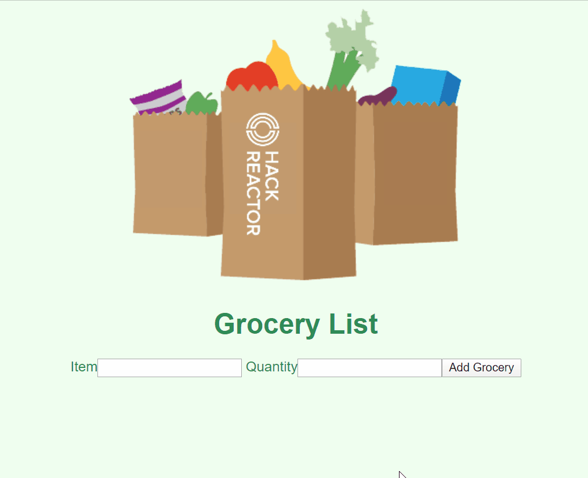

# grocery-list
Simple full-stack grocery list web application implemented using RESTful API routing

## Technoligies used:
- React/JSX
- Node.js
- ExpressJS
- MySQL
- Webpack

This is a project I completed as a student at [hackreactor](http://hackreactor.com).
